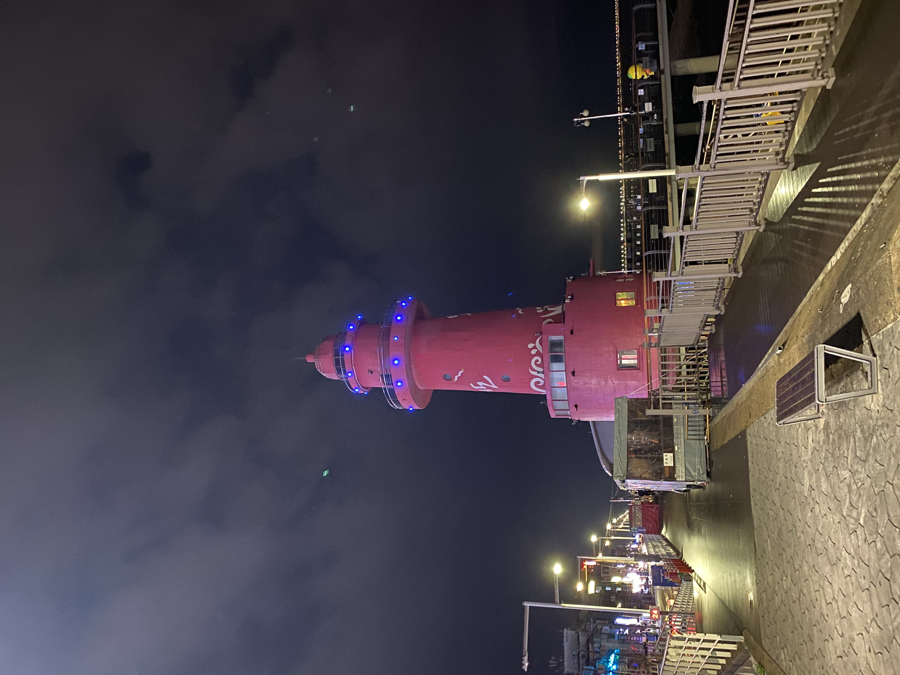
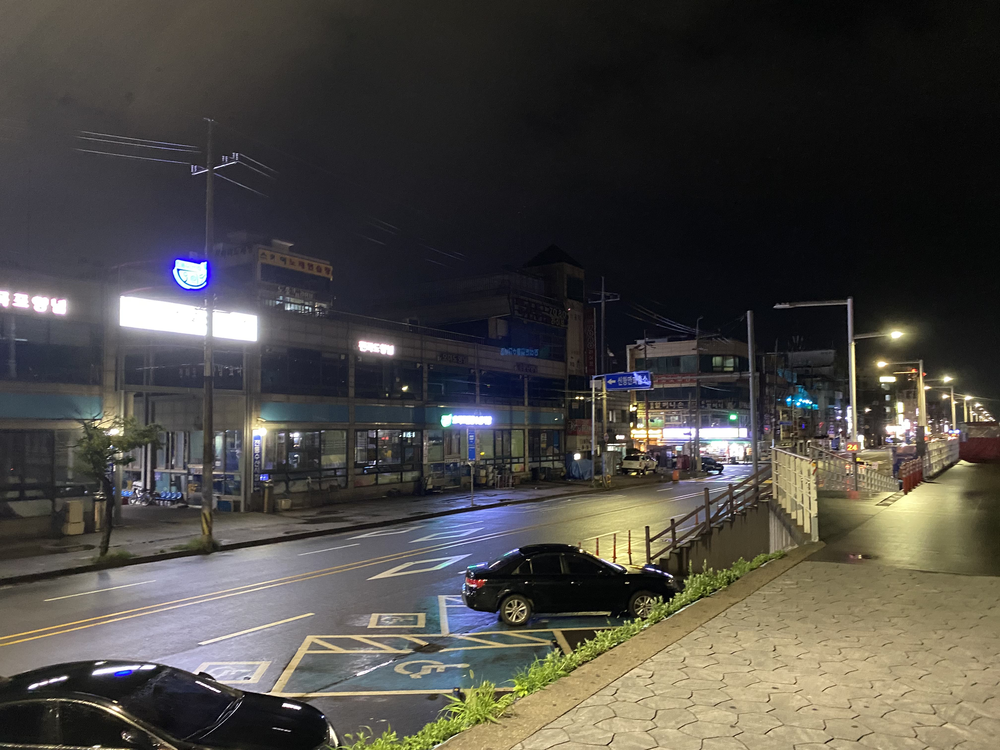
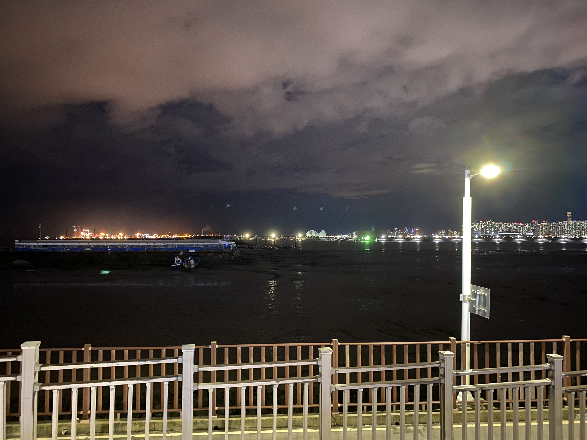
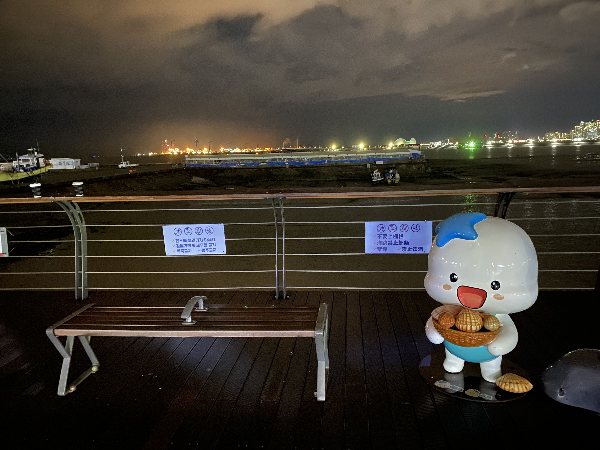

# 오이도 빨강등대 탐방

이 날은 오이도 빨강등대를 드라이브 했습니다. 오이도까지 오는 길에 바다를 통해서 통과하면 정말 드라이브 하기 좋은 도로가 있었고, 밤 11시를 넘었던 시점이라 차조차 막히지 않았습니다.

원래라면 빨강등대 앞에는 밤 11시가 넘더라도 아주머니들의 호객 행위로 인해 나름 시끄럽고 활기를 띄어야 하지만 시국이 시국이니 모든 가게들이 문을 닫은 모습입니다.

오이도에서 바라보는 밤 바다는 이런 모습입니다.

오이도에서 밀어주는 캐릭터인진 몰라도 빨강등대 앞에는 이런 캐릭터가 놓여져 있습니다.

딱히 별 다른 의도를 가지고 갔던 것이 아니기 때문에 사진 촬영 후 바로 돌아왔습니다. 이런 의미 없는 드라이브도 꽤 재미있었다고 생각합니다.