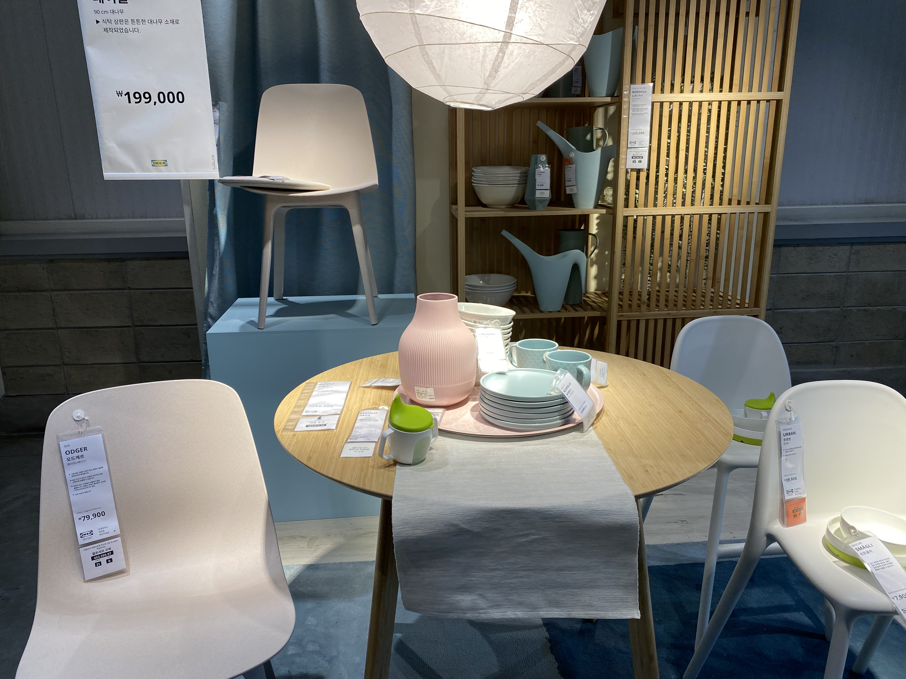

# 이케아 광명점 탐방

오늘은 광명에 있는 이케아에 왔습니다. 집에 있는 찬장이 너무 구식이라 새로운 찬장을 구입하기 위해 방문했는데 이케아에서는 모든 가구가 조립이 필요하다고 합니다.
주말에는 제가 집에 있으니 상관이 없는데 평일에는 제가 집에 있질 않으니 조립을 할 수 있는 사람이 없어서 완제품을 배송해주는 다른 업체에서 구입을 진행하기로 했습니다.
그런데 모처럼 광명까지 가서 이케아를 방문했으니 여러가지를 구경하고 집안을 꾸밀 소품들을 구입하는 시간을 가졌습니다.
## 이번 여정으로 새로 배운 점
- 주차장에서 주차할 때는 마지막으로 주차한 차 위치를 사진으로 찍어둘 것
- 이케아 매장은 굉장히 넓어서 볼게 많았지만, 동선이 다소 불편하게 설계 되어있었다는 점
  - 3번에서 본 상품을 구입하기 위해서 19번으로 이동해야하는 동선 설계는 이해가 되지 않았음.
- 외국에서는 IKEA의 '가구를 저렴하게, 인건비를 최소한으로' 전략이 잘 먹혔으나 우리나라에서는 잘 먹히지가 않는 것 같음.
  - 일단 가구의 배송 및 설치가 보편화 되어있는 우리나라에서는 셀프 조립이라는게 거부감이 심함.
  - 물론 돈을 주면 배송과 설치가 지원 되지만 가격이 절대 저렴한 편이 아님.
